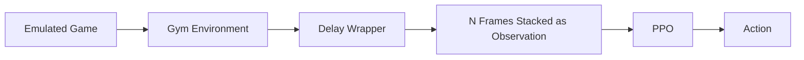

## Spring Quarter Objectives

- Add paddle-to-ball distance to the observation vector  
- Verify that latent vectors vary across the entire dataset  
- Train an agent to break even so the dataset is not biased (scores were ~20 for AI, 0 for agent) ✅ 
- Inject random noise into the VAE decoder and observe outputs  
- Visualize the dataset’s average latent vector  
- Introduce dropout  

## 9/16

- Model the delay as a buffer, not as NO-OP. The buffer should start with NO-OP and queue actions as it goes.✅ 
- Model observation delay.

## 9/25 - Update

The VAE-based approach has been set aside for now, as I was unable to achieve satisfactory results in reconstructing the game frames.  

## Current Pipeline




## Update

I focused on simulating the real-world movement delay, which is expected to be around 20 frames at 60 FPS (or 10 frames at 30 FPS), based on last quarter’s measurements. I implemented a wrapper to record the game running while also overlaying the joystick postion for debugging.


### Delay Buffer Approach

My first attempt implemented the delay using a buffer (queue). The idea was that the agent would need to “clear” the buffer before its chosen action took effect:

```python
self.action_queue = deque(
    [NO_OP] * delay_steps, 
    maxlen=delay_steps
)
```

Then, during each step:

```python
delayed_action = self.action_queue.popleft()
obs, reward, terminated, truncated, info = self.env.step(delayed_action)
self.action_queue.append(action)
```

While this worked mechanically, it produced unrealistic behavior. The agent could perform rapid consecutive up-and-down movements.  
In this example, I instructed the agent to wait for 5 sec (performing only NO OPs) and then begin alternating between **UP** and **DOWN** actions repeatedly.

<video src="https://github.com/user-attachments/assets/59dc4cf4-76fb-4250-b9b4-7408acf03f68"></video>

---

### Inertia-Based Approach

To address this, I introduced an inertia mechanism.  
When the agent selects a new action that differs from the current one, the transition is forced to unfold gradually:

- First **N//2 frames** → repeat the previous action  
- Next **N//2 frames** → perform NO OP  
- Finally → apply the new action  

This simulates the physical lag of changing direction and prevents unrealistic oscillations.  
I advance the environment during these intermediate steps before letting the model issue its next action.

In this example, I alternating between **UP** and **DOWN** actions repeatedly, with a delay of 1 sec:

<video src="https://github.com/user-attachments/assets/d50620f5-35f9-4f1a-b094-4f99ec170a98"></video>