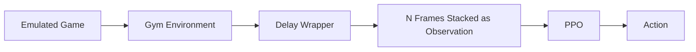

## Spring Quarter Objectives

- Add paddle-to-ball distance to the observation vector  
- Verify that latent vectors vary across the entire dataset  
- Train an agent to break even so the dataset is not biased (scores were ~20 for AI, 0 for agent) ✅ 
- Inject random noise into the VAE decoder and observe outputs  
- Visualize the dataset’s average latent vector  
- Introduce dropout  

## 9/16

- Model the delay as a buffer, not as NO-OP. The buffer should start with NO-OP and queue actions as it goes.✅ 
- Model observation delay.

## 9/25 - Update

The VAE-based approach has been set aside for now, as I was unable to achieve satisfactory results in reconstructing the game frames.  

## Current Pipeline




## Update

I focused on simulating the real-world movement delay, which is expected to be around 20 frames at 60 FPS (or 10 frames at 30 FPS), based on last quarter’s measurements. I implemented a wrapper to record the game running while also overlaying the joystick postion for debugging.


### Delay Buffer Approach

My first attempt implemented the delay using a buffer (queue). The idea was that the agent would need to “clear” the buffer before its chosen action took effect:

```python
self.action_queue = deque(
    [NO_OP] * delay_steps, 
    maxlen=delay_steps
)
```

Then, during each step:

```python
delayed_action = self.action_queue.popleft()
obs, reward, terminated, truncated, info = self.env.step(delayed_action)
self.action_queue.append(action)
```

While this worked mechanically, it produced unrealistic behavior. The agent could perform rapid consecutive up-and-down movements.  
In this example, I instructed the agent to wait for 5 sec (performing only NO OPs) and then begin alternating between **UP** and **DOWN** actions repeatedly.

<video src="https://github.com/user-attachments/assets/59dc4cf4-76fb-4250-b9b4-7408acf03f68"></video>

---

### Inertia-Based Approach

To address this, I introduced an inertia mechanism.  
When the agent selects a new action that differs from the current one, the transition is forced to unfold gradually:

- First **N//2 frames** → repeat the previous action  
- Next **N//2 frames** → perform NO OP  
- Finally → apply the new action  

This simulates the physical lag of changing direction and prevents unrealistic oscillations.  
I advance the environment during these intermediate steps before letting the model issue its next action.

In this example, I alternating between **UP** and **DOWN** actions repeatedly, with a delay of 1 sec:

<video src="https://github.com/user-attachments/assets/d50620f5-35f9-4f1a-b094-4f99ec170a98"></video>

### Meeting 9/25

- Load the checkpoint from a trained agent (no delay) to resume training on delay
- Train the agent


### Update 10/03

- Implemented a custom wrapper that also logs gameplay progress to TensorBoard during model training.

<video src="https://github.com/user-attachments/assets/045474fb-d19a-4f55-afeb-f226ae781f61"></video>

- Trained the model with no delay and attempted to play a game. I discovered that mapping actions other than the joystick was incorrect. The game also requires a **FIRE** button, and if it is mapped to **NO-OP**, the model’s behavior breaks.
- Developed a custom vectorized wrapper around the delay wrapper for the Pong environment. This was necessary due to how SB3 wraps Atari environments to enable parallelization. In my tests, it didn’t significantly improve training speed.
- Attempted training with a 30-frame delay. The results were poor. I loaded the base trained model, but no improvements were observed. I experimented with **PPO**, **DQN**, and even [Recurrent PPO](https://sb3-contrib.readthedocs.io/en/master/modules/ppo_recurrent.html) from [Stable Baselines3 Contrib](https://sb3-contrib.readthedocs.io/en/master/index.html), but none yielded progress.  
  I also considered algorithms suggested by Sinong:  
  - [DFBT](https://github.com/QingyuanWuNothing/DFBT)  
  - [VDPO](https://github.com/QingyuanWuNothing/VDPO)  
  - [AD-RL](https://github.com/QingyuanWuNothing/AD-RL)  

  However, these seem to require significant time investment since the networks are not modularized for easy integration into my current training pipeline.


- Finally, I switched to training with only a 5-frame delay. Results were noticeably better. Initially, there was little improvement, but eventually performance improved significantly. This was using vanilla PPO without frame stacking.


### Meeting 10/3

- Play Pong in an emulator to see if it behaves as expected.
- Train the agent for a long time.
- If SB3 does not work, look into implementing Sinong's code into the pipeline.

### Update — October 9

- Fixed several bugs related to the vectorization of the Pong environment.  
  Video logging is now functional, though the current setup does not yet feed observations back correctly during playback.
- Trained an agent to play Pong with a 30-frame delay.
- Evaluated the following methods:
  - PPO with a frame stack of 30
  - Recurrent PPO (SB3 Contrib) with no frame stack ([link to repository](https://github.com/Stable-Baselines-Team/stable-baselines3-contrib))
  - Recurrent PPO with a frame stack of 4

#### Performance Comparison


#### RPPO Agent Gameplay (No Frame Stack)

<video src="https://github.com/user-attachments/assets/83d6b8a2-d153-4731-b6b3-7a77f51f27dd" controls></video>


### Update — October 16

<video src="https://github.com/user-attachments/assets/74128eec-5ef4-44e1-8816-94de90563dc6" controls></video>

**Integrated ROS into the project**:
- `env_node.py`: A node that runs the game and publishes the game frames to a topic (`pong_frame`).  
  Removing frame-skip helped the game run at a much more reasonable speed.

    ```python
    self.env = VecTransposeImage(
        make_atari_env(
            env_id=ENV_NAME, 
            seed=5, 
            env_kwargs={"render_mode": "rgb_array"},
            wrapper_kwargs={"frame_skip": 0},  # Disabled frame skip for smoother visuals
        )
    )
    ```

- `node.py`: The control node inherits from `HelloNode`, which is provided by Hello Robot.  
  It loads the trained Recurrent PPO model, subscribes to the `pong_frame` topic, and pipes it into the model, which then commands the arm through a ROS action server (bottleneck ?). That server is implemented in ROS 1 and outside my control.  
  - I had to patch `ros2_numpy` to work with my Python version.

- I can use the robot drivers directly, which might yield better performance.  
  This is what I used during the delay testing, though it requires running code directly on the robot rather than through the ROS driver.  
 [Documentation](https://docs.hello-robot.com/0.3/python/moving/)

- I tested the model with input delays of 30, 40, and 50 frames but it didn't work.
  It becomes extremely sluggish at those delays — even when I am controlling the joystick it is difficult.


### Update — October 23


<video src = https://github.com/user-attachments/assets/15635331-57aa-4dd2-9bb0-258548aa46fb></video>

-**A new Control Node for the Stretch3**.

 The node runs on the Stretch3 and listens to commands from the model.
- The following QoS profile was used - is it the right choice?

 [Documentation](https://docs.ros.org/en/jazzy/Concepts/Intermediate/About-Quality-of-Service-Settings.html)
```python

  qos = QoSProfile(
      history=HistoryPolicy.KEEP_LAST, #only store up to N samples, configurable via the queue depth option.
      depth=1, # Store only the last one
      reliability=ReliabilityPolicy.BEST_EFFORT, #Attempt to deliver samples, but may lose them if the network is not robust.
      durability=DurabilityPolicy.VOLATILE  #No attempt is made to persist samples.
  )
```
<u>Observations</u>:

1. It seems too be slow
2. Responses were bagged for ~2.5 mins

| Time(ms) | Joystick Status | Commanded |
|----------|-----------------|-----------|
| 0        |                 |UP         |
| 10.391   | NO-OP           |           |
| 27.200   | NO-OP           |           |
| 43.782   | NO-OP           |           |
| 60.509   | NO-OP           |           |
| 77.350   | NO-OP           |           |
| 94.034   | NO-OP           |           |
| 110.550  | NO-OP           |           |
| 127.314  | NO-OP           |           |
| 143.976  | NO-OP           |           |
| 160.527  | NO-OP           |           |
| 177.264  | NO-OP           |           |
| 193.819  | NO-OP           |           |
| 210.394  | NO-OP           |           |
| 227.204  | NO-OP           |           |
| 243.775  | NO-OP           |           |
| 260.516  | NO-OP           |           |
| 277.419  | NO-OP           |           |
| 293.876  | NO-OP           |           |
| 310.618  | DOWN            |           |
| 327.355  | DOWN            |           |
| 343.902  | DOWN            |           |
| 360.612  | NO-OP           |           |
| 377.302  | NO-OP           |           |
| 393.858  | NO-OP           |           |
| 410.415  | NO-OP           |           |
| 427.250  | NO-OP           |           |
| 444.002  | NO-OP           |           |
| 460.457  | NO-OP           |           |
| 477.419  | NO-OP           |           |
| 493.861  | NO-OP           |           |
| 510.638  | NO-OP           |           |
| 527.312  | NO-OP           |           |
| 543.881  | NO-OP           |           |
| 560.559  | UP              |           |

**Example calculation**

This data snippet indicates an apparent delay of 560.6 ms, representing the time difference between the issued command and the actual observed status.

The average over ~2.5 minutes (Wireless) is shown below.


Results using an ethernet cable (~3.5 min of run time):


**Problems with the Enviorment**

The model was found to be "cheating" when reaching a really high delay value. The action histogram has been logged in TensorBoard:


The model should only be performing LEFT, RIGHT, and NO-OP, but the model is "cheating". The issue has been corrected (needs testing).


### **Inference Delay**


The inference delay benchmark was performed over 500 samples.  
Results indicate the following performance metrics:

- **Mean delay:** 3.655 ms  
- **Standard deviation:** 0.849 ms  
- **Total runtime:** 100 s

At this delay, the system achieves:
- **≈ 0.22 frames per 60 FPS frame**
- **≈ 0.11 frames per 30 FPS frame**

**Points of Concern**

- Is the modeled behaviour correct? Should stochasticity be introduced?
- Is using ROS here the right approach? If so, are topics the most effective communication mechanism (compared to services or actions)?


### Update — October 30

This week was focused on understanding why the current model fails to control the robot effectively. The control node was modified to wait for movement completion, resulting in slight improvement but continued late paddle movement. Models trained with 30, 40, 50, and 100 frame delays, as well as live FPS tuning, failed to resolve the timing issue; the 30-delay model performed best but still missed the ball.

A histogram analysis of model actions showed unaccounted Pong actions (“Fire Right” and “Fire Left”) that also move the paddle. These were added to the inertia wrapper, but retraining still produced poor performance. Even after 70M steps, the model tended to remain idle. Introducing a small penalty (-0.2) for NO-OP actions improved results slightly, while stronger penalties (-0.1, -0.5, -1) had no effect. The maximum reward is 21 and minimum is -21, with current training stabilizing around -19 and remaining noisy.

Training is now being conducted with half the delay steps, with the game running at half speed to test timing improvements. During model training, an initial review of one of three referenced papers revealed that the approaches handle delay using action or observation buffers. These implementations differ from physically realistic dynamic systems because they permit instantaneous action changes. Further clarification from Simon is being sought regarding this difference.


### Update — November 6

* Tested the environment with `delay = 0`, but the model still failed to converge.
* Changed approach: instead of manually wrapping Stable Baselines3’s `VecEnv` and then wrapping the environment around it, used the built-in `make_vec_env` function to construct the Atari environment. This mirrors the behavior of SB3’s internal `make_atari_env` function.

```python
def make_atari_env(
    env_id: Union[str, Callable[..., gym.Env]],
    n_envs: int = 1,
    seed: Optional[int] = None,
    start_index: int = 0,
    monitor_dir: Optional[str] = None,
    wrapper_kwargs: Optional[dict[str, Any]] = None,
    env_kwargs: Optional[dict[str, Any]] = None,
    vec_env_cls: Optional[Union[type[DummyVecEnv], type[SubprocVecEnv]]] = None,
    vec_env_kwargs: Optional[dict[str, Any]] = None,
    monitor_kwargs: Optional[dict[str, Any]] = None,
) -> VecEnv:
    """
    Creates a wrapped, monitored VecEnv for Atari environments.
    This is a wrapper around ``make_vec_env`` that includes common preprocessing for Atari games.
    """
    return make_vec_env(
        env_id,
        n_envs=n_envs,
        seed=seed,
        start_index=start_index,
        monitor_dir=monitor_dir,
        wrapper_class=AtariWrapper,  # <--- Main difference
        env_kwargs=env_kwargs,
        vec_env_cls=vec_env_cls,
        vec_env_kwargs=vec_env_kwargs,
        monitor_kwargs=monitor_kwargs,
        wrapper_kwargs=wrapper_kwargs,
    )
```

In testing, it was unclear whether manually passing a custom environment creation function like the one below performed as well as `make_atari_env`:

```python
def make_pong_env():
    env = gym.make(ENV_NAME)
    env = AtariWrapper(env)
    env = PongDelayInertiaWrapper(env, delay_steps=DELAY)
    return env

# Then wrapped with:
env = make_vec_env(make_pong_env, N_ENVS)
```

To simplify and control the wrapper order more cleanly, switched to a wrapper chain class, which sequentially applies each wrapper:

```python
wrap = make_wrapper_chain([
    (PongDelayInertiaWrapper, {"delay_steps": DELAY}),
    (AtariWrapper, {}),
    (ActionSubsetWrapper, {
        "allowed_actions": [
            k for k, v in ALE_ACTION_MAP.items() if v in {"NO-OP", "RIGHT", "LEFT"}
        ]
    }),
    (ActionPenalty, {"penalized_actions": [REV_ACTION_MAP["NO-OP"]], "penalty": REW}),
])

env = make_vec_env(ENV_NAME, N_ENVS, wrapper_class=wrap)
```

**Note:** `PongDelayInertiaWrapper` must be applied before `AtariWrapper` because `AtariWrapper` introduces a frame skip (`=4`). Reversing the order would amplify the delay by the frame skip factor.

---

* Finally, tested all Stable Baselines3 (and contrib) policies that support image-based observations.
  The figure below shows comparative performance across models:


### Update — November 13


<video src="https://github.com/user-attachments/assets/eef50b27-4beb-4fc7-b969-0457e76acc26"></video>

* Tested the setup entirely in ROS simulation; the agent was still unable to win the game despite the controlled environment.
* Added domain randomization: the delay is now sampled from a pool of previously measured delays, with additional Gaussian noise (using a standard deviation derived from the delay distribution). The resulting delay is clipped to remain above the minimum measured value.
* Migrated the codebase to run fully onboard, removing ROS dependencies and enabling standalone execution.
* Observed partial success during gameplay: the agent often maneuvers to a specific position and remains stationary while winning, exposing a flaw in the game logic.
* Agent behavior remains inconsistent. Success depends on reaching that position, which occasionally fails, resulting in game losses.
* Continued training did not improve performance; in several cases, performance degraded further.
* The robot’s gripper exhibits slipping, potentially contributing to unstable results. Model training remains slow.
* Currently collecting additional delay measurements to better capture real-world behavior and improve model fidelity.
