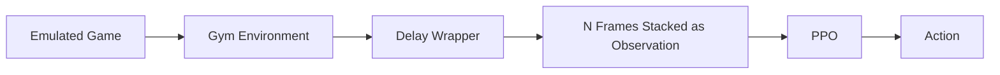

## Spring Quarter Objectives

- Add paddle-to-ball distance to the observation vector  
- Verify that latent vectors vary across the entire dataset  
- Train an agent to break even so the dataset is not biased (scores were ~20 for AI, 0 for agent) ✅ 
- Inject random noise into the VAE decoder and observe outputs  
- Visualize the dataset’s average latent vector  
- Introduce dropout  

## 9/16

- Model the delay as a buffer, not as NO-OP. The buffer should start with NO-OP and queue actions as it goes.✅ 
- Model observation delay.

## 9/25 - Update

The VAE-based approach has been set aside for now, as I was unable to achieve satisfactory results in reconstructing the game frames.  

## Current Pipeline




## Update

I focused on simulating the real-world movement delay, which is expected to be around 20 frames at 60 FPS (or 10 frames at 30 FPS), based on last quarter’s measurements. I implemented a wrapper to record the game running while also overlaying the joystick postion for debugging.


### Delay Buffer Approach

My first attempt implemented the delay using a buffer (queue). The idea was that the agent would need to “clear” the buffer before its chosen action took effect:

```python
self.action_queue = deque(
    [NO_OP] * delay_steps, 
    maxlen=delay_steps
)
```

Then, during each step:

```python
delayed_action = self.action_queue.popleft()
obs, reward, terminated, truncated, info = self.env.step(delayed_action)
self.action_queue.append(action)
```

While this worked mechanically, it produced unrealistic behavior. The agent could perform rapid consecutive up-and-down movements.  
In this example, I instructed the agent to wait for 5 sec (performing only NO OPs) and then begin alternating between **UP** and **DOWN** actions repeatedly.

<video src="https://github.com/user-attachments/assets/59dc4cf4-76fb-4250-b9b4-7408acf03f68"></video>

---

### Inertia-Based Approach

To address this, I introduced an inertia mechanism.  
When the agent selects a new action that differs from the current one, the transition is forced to unfold gradually:

- First **N//2 frames** → repeat the previous action  
- Next **N//2 frames** → perform NO OP  
- Finally → apply the new action  

This simulates the physical lag of changing direction and prevents unrealistic oscillations.  
I advance the environment during these intermediate steps before letting the model issue its next action.

In this example, I alternating between **UP** and **DOWN** actions repeatedly, with a delay of 1 sec:

<video src="https://github.com/user-attachments/assets/d50620f5-35f9-4f1a-b094-4f99ec170a98"></video>

### Meeting 9/25

- Load the checkpoint from a trained agent (no delay) to resume training on delay
- Train the agent


### Update 10/03

- Implemented a custom wrapper that also logs gameplay progress to TensorBoard during model training.

<video src="https://github.com/user-attachments/assets/045474fb-d19a-4f55-afeb-f226ae781f61"></video>

- Trained the model with no delay and attempted to play a game. I discovered that mapping actions other than the joystick was incorrect. The game also requires a **FIRE** button, and if it is mapped to **NO-OP**, the model’s behavior breaks.
- Developed a custom vectorized wrapper around the delay wrapper for the Pong environment. This was necessary due to how SB3 wraps Atari environments to enable parallelization. In my tests, it didn’t significantly improve training speed.
- Attempted training with a 30-frame delay. The results were poor. I loaded the base trained model, but no improvements were observed. I experimented with **PPO**, **DQN**, and even [Recurrent PPO](https://sb3-contrib.readthedocs.io/en/master/modules/ppo_recurrent.html) from [Stable Baselines3 Contrib](https://sb3-contrib.readthedocs.io/en/master/index.html), but none yielded progress.  
  I also considered algorithms suggested by Sinong:  
  - [DFBT](https://github.com/QingyuanWuNothing/DFBT)  
  - [VDPO](https://github.com/QingyuanWuNothing/VDPO)  
  - [AD-RL](https://github.com/QingyuanWuNothing/AD-RL)  

  However, these seem to require significant time investment since the networks are not modularized for easy integration into my current training pipeline.


- Finally, I switched to training with only a 5-frame delay. Results were noticeably better. Initially, there was little improvement, but eventually performance improved significantly. This was using vanilla PPO without frame stacking.


### Meeting 10/3

- Play Pong in an emulator to see if it behaves as expected.
- Train the agent for a long time.
- If SB3 does not work, look into implementing Sinong's code into the pipeline.

### Update — October 9

- Fixed several bugs related to the vectorization of the Pong environment.  
  Video logging is now functional, though the current setup does not yet feed observations back correctly during playback.
- Trained an agent to play Pong with a 30-frame delay.
- Evaluated the following methods:
  - PPO with a frame stack of 30
  - Recurrent PPO (SB3 Contrib) with no frame stack ([link to repository](https://github.com/Stable-Baselines-Team/stable-baselines3-contrib))
  - Recurrent PPO with a frame stack of 4

#### Performance Comparison


#### RPPO Agent Gameplay (No Frame Stack)

<video src="https://github.com/user-attachments/assets/83d6b8a2-d153-4731-b6b3-7a77f51f27dd" controls></video>


### Update — October 16

<video src="https://github.com/user-attachments/assets/74128eec-5ef4-44e1-8816-94de90563dc6" controls></video>

**Integrated ROS into the project**:
- `env_node.py`: A node that runs the game and publishes the game frames to a topic (`pong_frame`).  
  Removing frame-skip helped the game run at a much more reasonable speed.

    ```python
    self.env = VecTransposeImage(
        make_atari_env(
            env_id=ENV_NAME, 
            seed=5, 
            env_kwargs={"render_mode": "rgb_array"},
            wrapper_kwargs={"frame_skip": 0},  # Disabled frame skip for smoother visuals
        )
    )
    ```

- `node.py`: The control node inherits from `HelloNode`, which is provided by Hello Robot.  
  It loads the trained Recurrent PPO model, subscribes to the `pong_frame` topic, and pipes it into the model, which then commands the arm through a ROS action server (bottleneck ?). That server is implemented in ROS 1 and outside my control.  
  - I had to patch `ros2_numpy` to work with my Python version.

- I can use the robot drivers directly, which might yield better performance.  
  This is what I used during the delay testing, though it requires running code directly on the robot rather than through the ROS driver.  
 [Documentation](https://docs.hello-robot.com/0.3/python/moving/)

- I tested the model with input delays of 30, 40, and 50 frames but it didn't work.
  It becomes extremely sluggish at those delays — even when I am controlling the joystick it is difficult.
