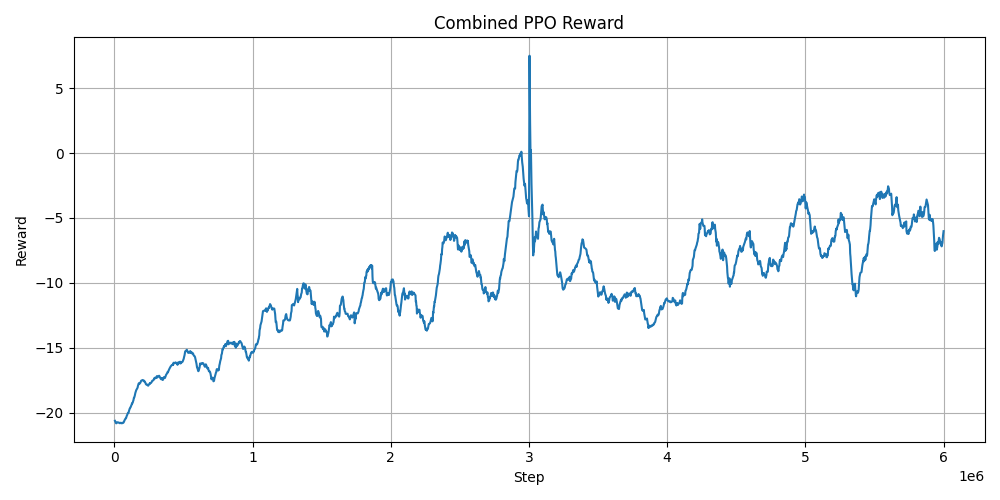
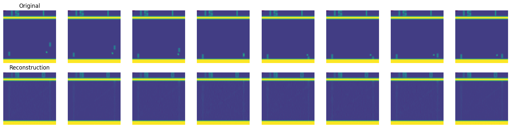
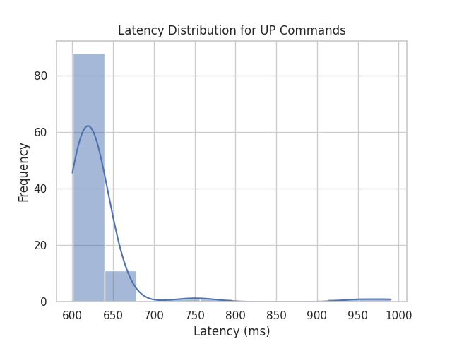
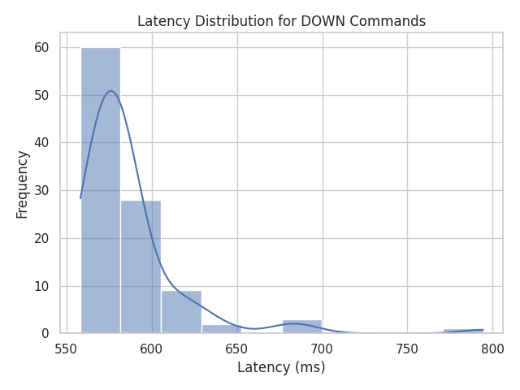

# Robot Arm Plays Arcade - Spring Project Summary

Ben Benyamin

June 12 , 2025

## Week 1 – 4/17 to 4/24

The first week was spent mostly on understanding the task at hand and learning reinforcement learning, as I was unfamiliar with its practical use. I wanted to tackle the vanilla problem before adding complexity. I read the first chapter of [Reinforcement Learning: An Introduction](http://incompleteideas.net/book/the-book-2nd.html) and implemented PPO from scratch, running it on the [CartPole environment in Gymnasium](https://gymnasium.farama.org/environments/classic_control/cart_pole/) to gain a deeper understanding of what is going on.

## Week 2 – 4/24 to 5/1

This week I shifted to the Stable Baselines implementation of PPO to see if I could get things working with a more tested codebase, and the agent balanced the cart-pole better than my implementation. I also trained it to play the arcade game Pong, which I found intuitive.It was decided to use the Stretch from Hello Robot to manipulate the arcade stick.

## Week 3 – 5/1 to 5/8

This week I worked on both facets: hardware and software simultaneously.  
**Software:** I tried to wrap the Pong Gymnasium environment to include real-world robotic delay. I modeled the delay as a number of NO-OPs per action: the agent chooses an action, then executes a predefined number of NO-OPs while stepping the environment. The agent performed decently, averaging about –5 (losing by 5 points) for 1 and 2 NO-OPs. The 1-NO-OP agent performed miserably (–21, the minimum score) in the 2-NO-OP environment, and vice versa. It was concluded that previous frames should be added to the observation space to capture the temporal effect.  
**Hardware:** The robot moved via the web teleop interface, but some joints (gripper and arm) did not respond. It turned out next week to be a calibration issue.

## Week 4 – 5/8 to 5/15

This week I tried to wrap the Pong environment with the previous steps, but it failed to run because Stable Baselines, Gymnasium, and Atari environments are somewhat incompatible. On the hardware side, recalibrating the robot resolved the joint movement issue.

## Week 5 – 5/15 to 5/22

I got the wrapper running, but results remained poor. It augments each observation with one-hot encoded “action planes” for previous actions. After training for 6 million steps, there was still no improvement, as shown in the plot below. I also tried to measure the robot arm’s latency during Pong gameplay but had a bug in my timing code (it reported 7 ms, which is too fast).

## Week 6 – 5/22 to 5/29

This week I trained a VAE to obtain a latent representation of the frames, hoping to compactly encode previous-frame information. I used working code from my GenAI class ([repo](https://github.com/BenBenyamin/VAE-Remove)), but reconstructions were very blurry. I changed hyperparameters and experimented with MSE and Dice losses to no avail. I performed online training (taking random actions, collecting frames, and training the VAE).

On the hardware side, I fixed the delay-measurement bug and obtained reliable latency data for wired and wireless connections:

  

| Target   | Mean Latency (ms) | Std Deviation (ms) | Frames @ 60 FPS | Frames @ 30 FPS |
| -------- | ----------------- | ------------------ | --------------- | --------------- |
| **UP**   | 630.07            | 53.08              | 37.80           | 18.90           |
| **DOWN** | 586.28            | 31.99              | 35.18           | 17.59           |

<video src = "https://github.com/user-attachments/assets/88aa5277-584a-426f-9f1a-6f123c458b8f"></video>

## Week 7 – 5/29 to 6/4

This week I tried to eliminate some unknowns regarding the VAE’s performance:
- Changed to offline training (10 k examples)  
- Set the ε std in the VAE’s reparameterization trick to 0.5  
- Tested different latent sizes  

Results remained blurry. As a sanity check, I implemented a simple CV algorithm to estimate game state:

- Ball = brightest pixel after cropping the frame to a center of the game frame.
- Paddles = vertical strips in predefined columns; center point gives paddle y  
- Score was not calculated but used from the environment.

The algorithm receives an 84×84 grayscale frame and returns `(agent_paddle_y, ai_paddle_y, ball_x, ball_y)` to an MLP-based PPO agent. The agent did not learn a winning policy.

<video src = "https://github.com/user-attachments/assets/fd268322-e72d-4930-a016-ba31a3f3bc2b"></video>

## Goals / Next Steps for the Final Quarter

Per the last meeting on 4/6, I will first:

- Add paddle-to-ball distance to the observation vector  
- Verify that latent vectors vary across the entire dataset  
- Train an agent to break even so the dataset is not biased (scores were ~20 for AI, 0 for agent)  
- Inject random noise into the VAE decoder and observe outputs  
- Visualize the dataset’s average latent vector  
- Introduce dropout  

For the final quarter, the goals are as follows, I’ve outlined several milestones that I believe form the incremental path to successful project completion, though they remain open to change and feedback:

- Train a delay-aware agent in simulation to beat Pong in a generalizable way (VAE approach under test)  
- Deploy it on the robot using simulated images (no camera) and assess real‐world performance  
- Integrate the camera so the robot can play Pong with live video  
